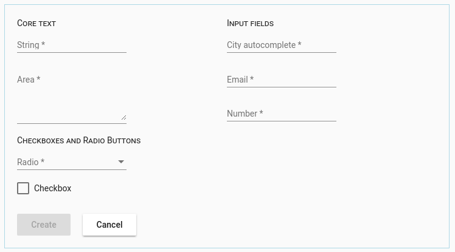

Django Rest Framework meets Angular dynamic forms
=================================================

This repo provides Django mixins and Angular library for rapid
development of create/edit dialogs for django rest framework.
It depends on Angular5 together with Material UI.

On the django side, extend your Viewset to use AngularFormMixin
and optionally configure the mixin by providing either layout
information or field defaults (such as css classes). See demos
for details.

.. code-block:: python

class CityViewSet(AngularFormMixin, viewsets.ModelViewSet):
    """
    API for cities
    """
    queryset = City.objects.all()
    serializer_class = CitySerializer

On angular side, use ``DjangoFormDialogService`` to display a dialog:

.. code-block:: typescript

    constructor(private dialog: DjangoFormDialogService) {
    }
    createCity() {
        this.dialog.open('/api/1.0/cities/').subscribe(result => {
            this.code.update('response', result);
        });
    }

You can also display the form inside your own component via ``<inpage-django-form>`` tag.

.. code-block:: html

<inpage-django-form django_url="/api/1.0/cities/"
                        (submit)="submit($event)"
                        (cancel)="cancel($event)"></inpage-django-form>

Demo and sample source files
----------------------------

See demos at http://mesemus.no-ip.org:12569

Installation
------------

*Django side:*

pip install django-angular-dynamic-forms

*Angular side:*

npm install --save django-angular-dynamic-forms

and add ``DjangoFormModule`` to imports. You will need to provide your own ErrorService for showing
communication errors back to the user. See the ``demo/angular/src/app/mat-error.service.ts`` for
an example implementation.

